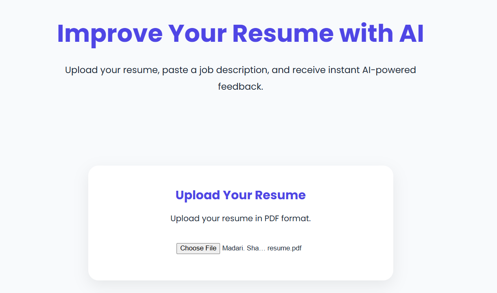
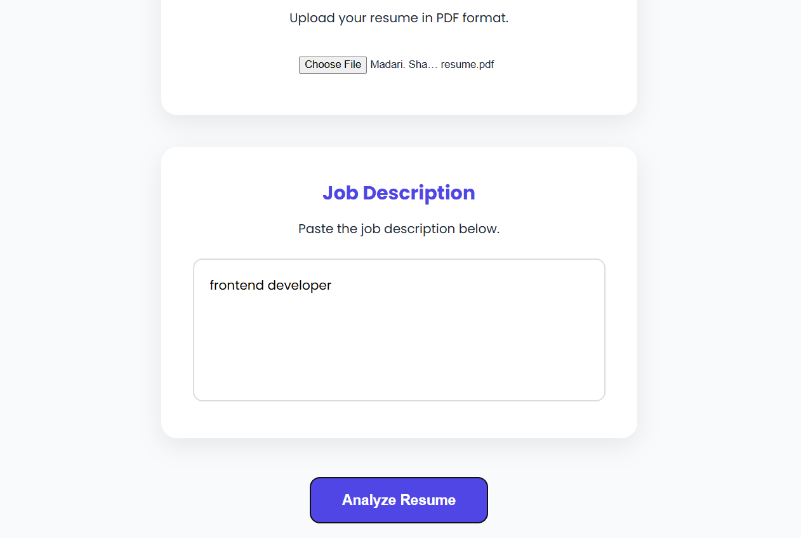
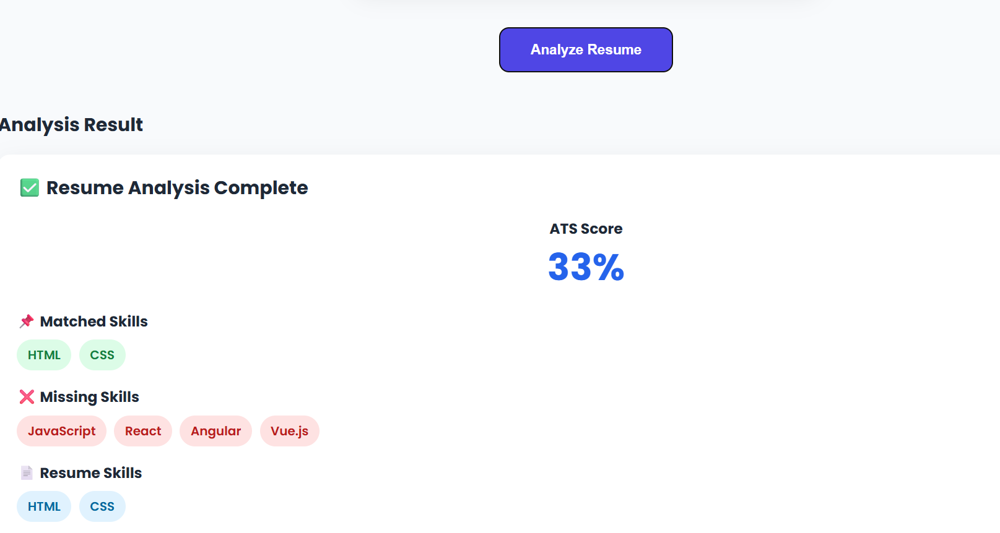

# AI Resume Analyzer 🚀

An AI-powered web application that analyzes resumes against job descriptions and provides insights such as matched skills, missing skills, and ATS compatibility score.

---

## 📌 Project Overview

AI Resume Analyzer helps users compare their resumes with a job description.

The application allows users to:
- Upload a PDF resume
- Enter a job description
- Compare resume skills with job requirements
- View matched skills
- View missing skills
- Get an ATS compatibility score

---

## ✨ Features

- 📄 Upload Resume (PDF)
- 📝 Enter Job Description
- 🔍 Extract Resume Skills
- ✅ Show Matched Skills
- ❌ Show Missing Skills
- 📊 Calculate ATS Score
- ⚡ Easy-to-use Interface

---

## 🛠️ Tech Stack

### Frontend
- HTML
- CSS
- JavaScript

### Backend
- Node.js
- Express.js

### Packages
- Multer
- pdf-parse
- CORS
- dotenv

---

## 📸 Screenshots

### Home Page

### Job Description

### Analysis Result

